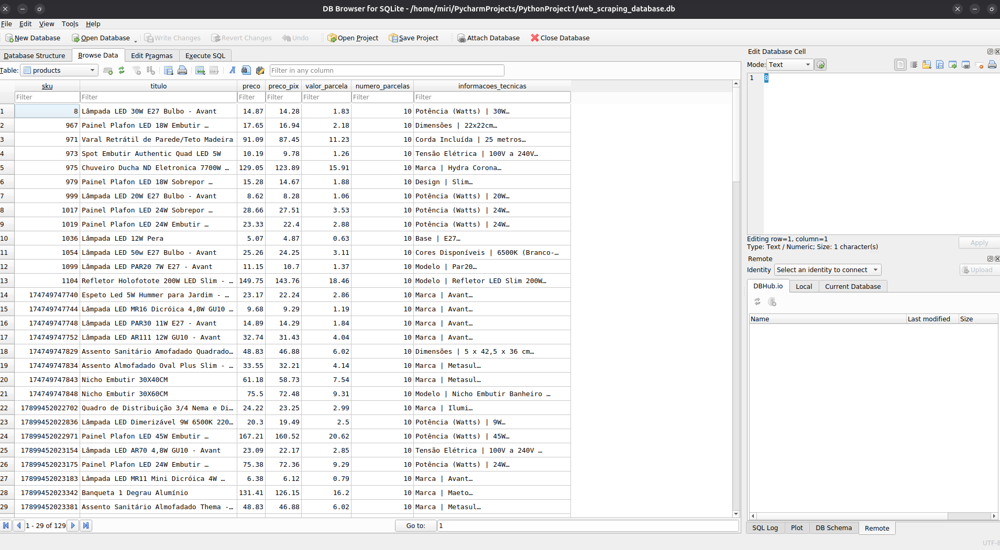
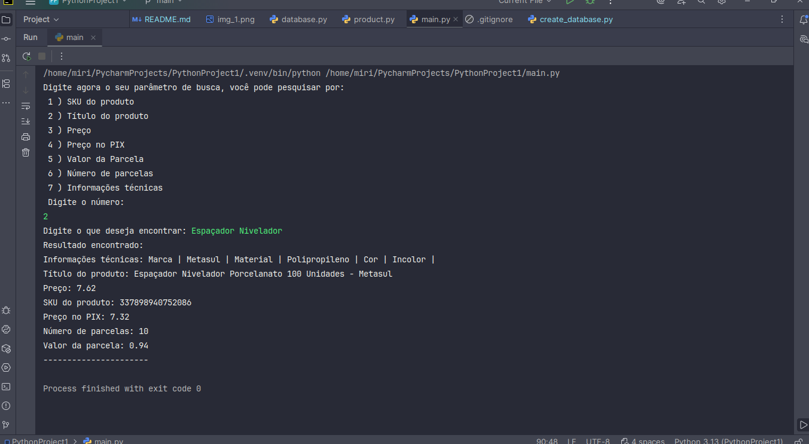
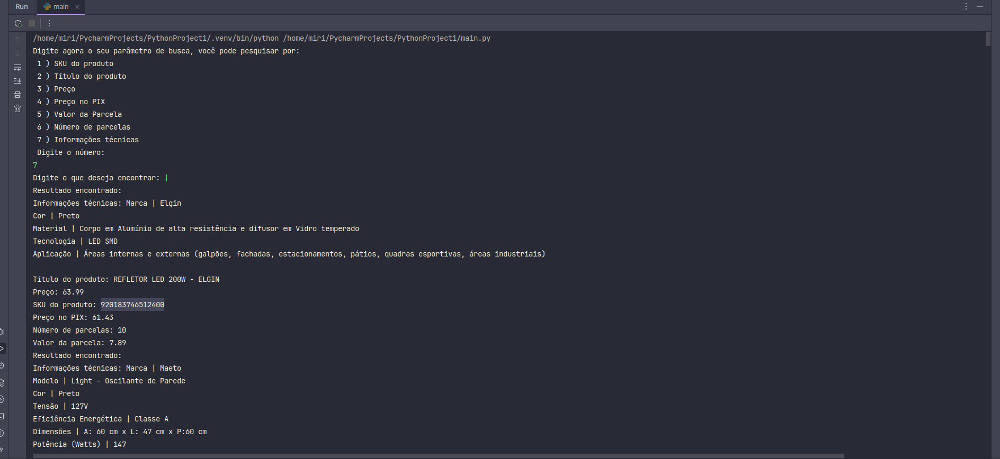

# Web Scraping e Banco de Dados SQLite3 - Como executar a aplicação (passo a passo)

# De início, clone o repositório
git clone https://github.com/mirimachado/Web-Scraping-e-Banco-de-Dados-SQLite3.git

# Instale as dependências (utilizei as seguintes)
- pip install requests
- pip install beautifulsoup4
- e o banco de dados sqlite3 (se necessário)

# Rodando o projeto - instruções
python main.py

No terminal, digite conforme solicitado, você pode pesquisar por palavras que vão conter os resultados que deseja, por exemplo: "LED SMD".
É possível pesquisar por informações técnicas, como exemplo: "Corpo em Alumínio de alta resistência e difusor em Vidro temperado", é possível por 
pesquisar por título do produto, como exemplo: "REFLETOR LED 200W", por preço, por exemplo "61.43", por preço no PIX, número de parcelas e SKU do produto, por exemplo "920183746512400".

# O banco de dados é alimentado conforme as pesquisas vão sendo realizadas

# Exemplos de busca
- Se buscar por "Espaçador Nivelador", todos os títulos de produtos com "Espaçador Nivelador", serão retornados no terminal e serão salvos no banco, incluindo atualização caso já exista esse produto no banco.

- Se buscar por "|", todas as informações técnicas que tiverem "|", serão retornadas no terminal e salvas no banco, incluindo atualização caso a mesma já exista no banco.

# Observações

- A princípio, fiz o projeto em português para deixar mais lúdico, mas eu tendo a deixar meus projetos padronizados em inglês.
- O processo de busca no site pode demorar alguns segundos para retornar todos os resultados encontrados.
- O arquivo gerado do banco de dados fica disponível para abrir e verificar os dados que foram salvos.
